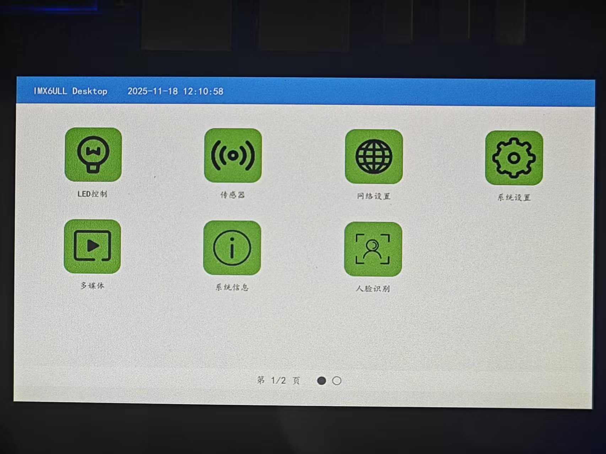
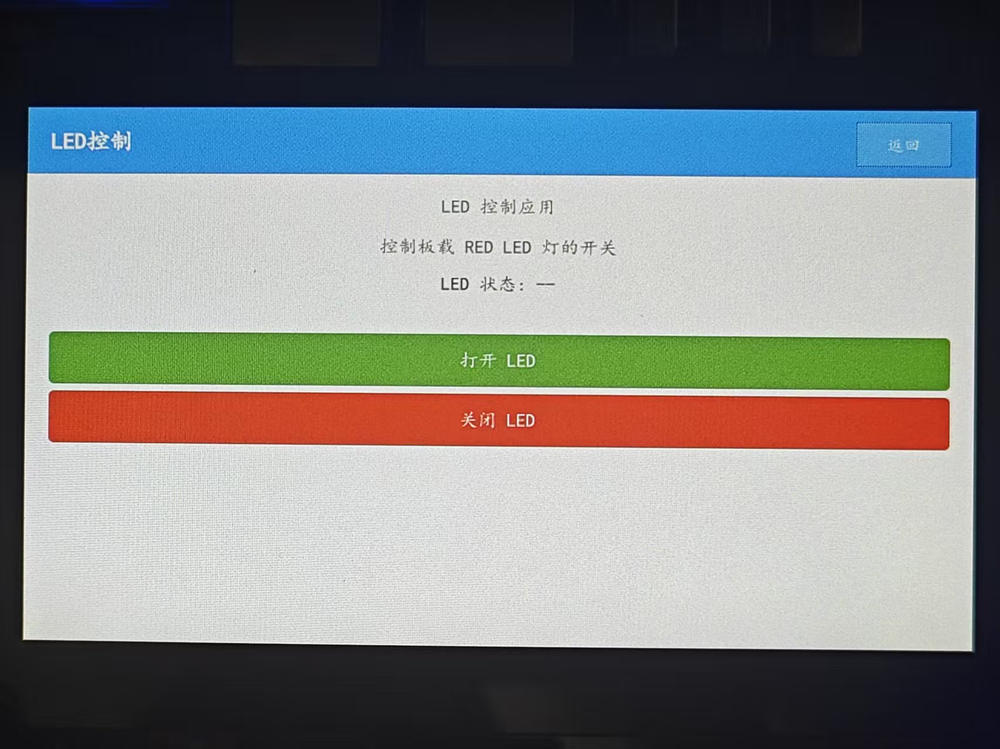
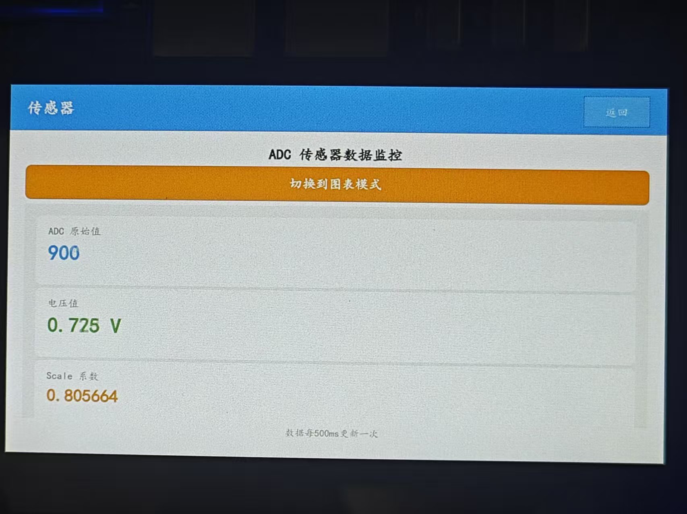
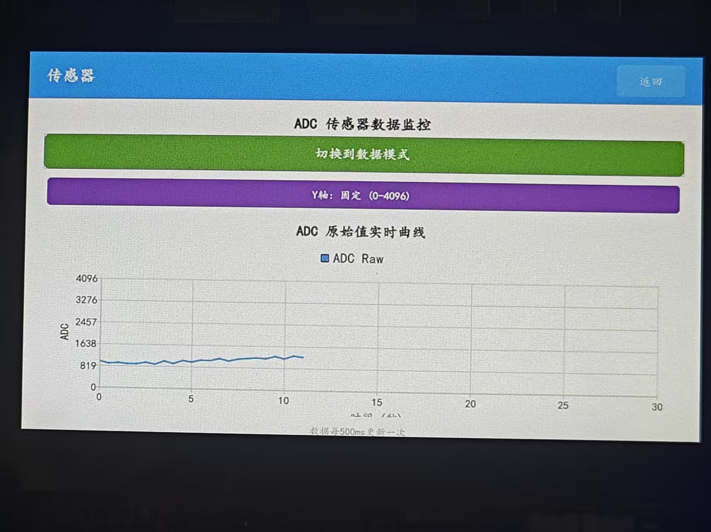
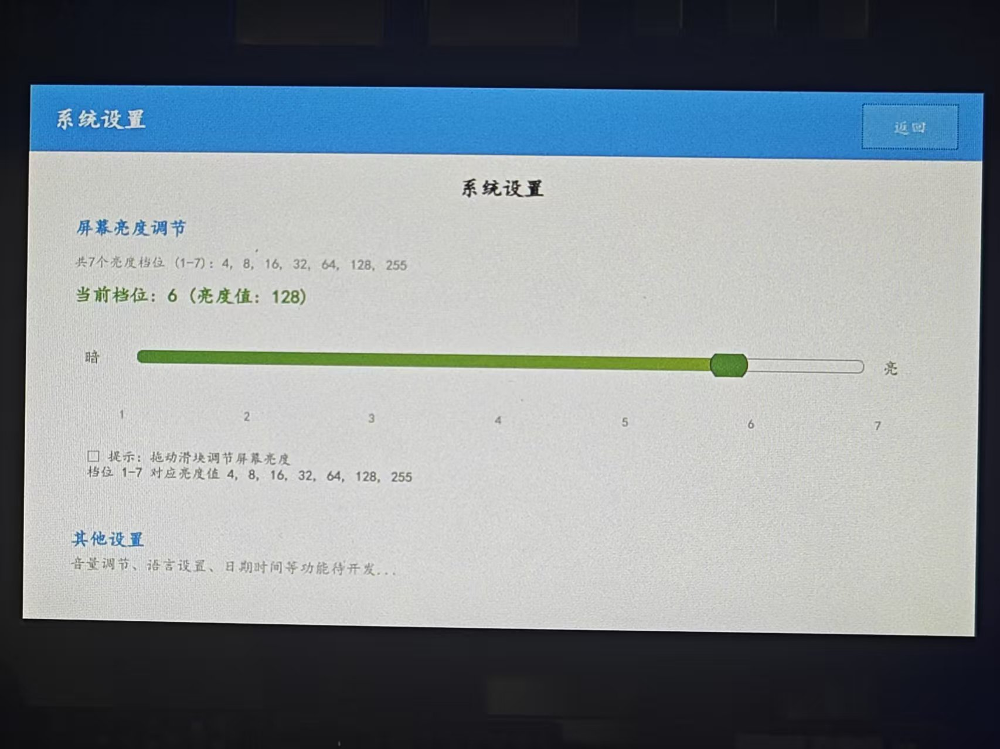
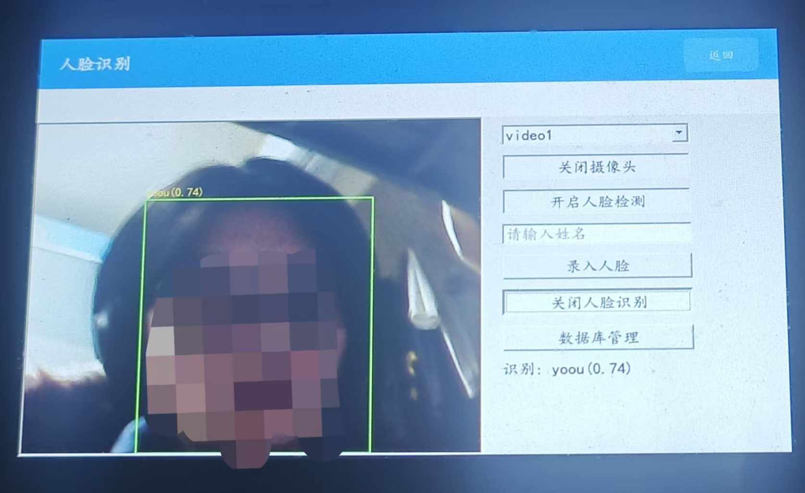

# IMX6ULL Desktop

基于 Qt 5.12.9 开发的嵌入式桌面应用系统，专为 NXP i.MX6ULL 平台设计，集成了多种系统控制、传感器监控、多媒体播放和人脸识别等功能。

## 界面预览

### 桌面主界面


### LED 控制


### 传感器监控




### 系统设置


### 人脸识别


## 项目概述

IMX6ULL Desktop 是一个功能完整的嵌入式图形界面应用程序，提供了类似智能手机的桌面交互体验。项目采用 Qt Widgets 框架开发，支持触摸屏操作，具有良好的用户交互体验和视觉效果。

## 核心功能

### 1. LED 控制
- 控制系统LED灯的开关状态
- 通过 sysfs 接口与内核驱动交互
- 提供直观的按钮界面控制

### 2. 传感器监控
- **ADC 采样**：实时读取模拟信号，显示原始值、缩放系数和电压值
- **温度监控**：采集并显示系统温度传感器数据
- **光敏传感器**：监测环境光照强度
- **自动刷新**：定时器驱动，每秒自动更新传感器数据
- 数据可视化展示

### 3. 网络设置
- 查看和配置网络接口（有线/无线）
- IP 地址配置（静态/DHCP）
- 子网掩码、网关设置
- DNS 服务器配置
- 实时显示网络连接状态

### 4. 系统设置
- **屏幕亮度调节**：通过滑块控制背光亮度（0-255级）
- **音量控制**：系统音量调节
- **时间设置**：手动设置系统时间和日期
- **开机自启动**：配置应用程序开机自动运行
- 通过 sysfs 接口直接控制硬件

### 5. 多媒体播放器
- **音频播放**：支持常见音频格式（MP3, WAV, FLAC等）
- **播放控制**：播放/暂停、上一曲/下一曲
- **进度控制**：拖动进度条快速定位
- **音量调节**：独立音量控制
- **CD 动画**：旋转光盘视觉效果
- 播放列表管理

### 6. 系统信息
实时获取和显示本机系统信息：
- **主机名**：系统主机标识
- **内核版本**：Linux 内核版本信息
- **CPU 信息**：型号、核心数
- **内存状态**：总量、已用、可用、使用百分比
- **存储信息**：根分区容量、使用情况
- **运行时间**：系统启动后的运行时长
- **系统负载**：1分钟、5分钟、15分钟平均负载
- **网络接口**：显示所有网络接口及其IP地址
- 支持手动刷新更新信息

### 7. 人脸识别 ⭐
集成 SeetaFace2 人脸识别引擎，提供完整的人脸识别解决方案：

#### 核心功能
- **人脸检测**：实时检测摄像头画面中的人脸，绘制矩形框标记
- **人脸录入**：采集人脸特征并存储到本地数据库
- **人脸识别**：识别已录入人脸，显示姓名和相似度
- **数据库管理**：
  - 表格形式展示所有已录入人脸信息
  - 显示姓名、录入时间、特征数据大小
  - 支持单个删除操作
  - 统计信息显示（总人数）

#### 技术特性
- **摄像头支持**：
  - 使用 OpenCV VideoCapture 统一封装
  - 支持 USB 摄像头和板载摄像头
  - 30 FPS 实时视频流
  - 640x480 分辨率
  
- **跨平台设计**：
  - ARM 平台：完整的人脸识别功能（SeetaFace2）
  - PC 平台：仅摄像头预览（通过条件编译 `#ifdef __arm__`）
  
- **数据持久化**：
  - 二进制格式存储人脸特征（QDataStream）
  - 自动加载和保存数据库
  - 人脸特征向量（2048维浮点数组）

- **虚拟键盘**：
  - 触屏友好的输入方式
  - 支持三种模式：数字、小写字母、大写字母
  - 模式切换按钮
  - 退格和确认功能

#### 识别算法
- **人脸检测**：SeetaFace FaceDetector
- **相似度计算**：余弦相似度，阈值0.6

## 技术架构

### 开发框架
- **Qt 5.12.9**：跨平台C++图形用户界面框架
  - Qt Widgets：UI组件
  - Qt Charts：数据可视化（传感器数据展示）
  - Qt Network：网络时间同步
  - Qt Multimedia：音频播放（预留）

### 第三方库
- **OpenCV 3.4.1**：计算机视觉库
  - 摄像头采集
  - 图像处理和格式转换
  - Mat 与 QImage 互转
  
- **SeetaFace2**：开源人脸识别引擎（仅ARM平台）
  - FaceDetector：人脸检测
  - FaceLandmarker：关键点定位
  - FaceRecognizer：人脸识别

## 界面设计

### 桌面主界面
- 顶部状态栏：显示系统时间和同步状态
- 中间应用图标区：4列网格布局，每个图标包含图片和文字
- 底部页面指示器：显示当前页码和总页数
- 支持左右滑动切换页面

### 应用界面
- 全屏显示
- 统一的标题栏和返回按钮
- 响应式布局设计
- 触摸友好的按钮尺寸

## 编译配置

### 条件编译
项目支持 ARM 和 PC 平台编译，通过 Qt 的架构检测自动配置：

```qmake
TARGET_ARCH = $${QT_ARCH}
contains(TARGET_ARCH, arm){
    # ARM平台配置
    # 包含完整的OpenCV和SeetaFace2库
} else {
    # PC平台配置
    # 仅包含OpenCV，使用pkg-config
}
```

### 依赖库路径
- **ARM 平台**：
  - OpenCV：`/home/you/opencv-3.4.1/install`
  - SeetaFace2：`/home/you/SeetaFace2/build-arm/install`
  - 运行时库路径：`/usr/local/lib`

- **PC 平台**：
  - OpenCV：通过 pkg-config 自动配置

## 项目结构

```
imx6ull_desktop/
├── main.cpp                    # 程序入口
├── mainwindow.h/cpp           # 主窗口（桌面）
├── iconwidget.h/cpp           # 应用图标组件
├── sliderwidget.h/cpp         # 页面滑动组件
├── appdialog.h/cpp            # 应用对话框容器
├── musicplayer.h/cpp          # 音乐播放器
├── cdwidget.h/cpp             # CD动画组件
├── camera.h/cpp               # 摄像头封装
├── facerecognition.h/cpp      # 人脸识别模块
├── virtualkeyboard.h/cpp      # 虚拟键盘
├── mainwindow.ui              # UI设计文件
├── resources.qrc              # 资源文件
├── icon/                      # 应用图标目录
│   ├── led_icon.png
│   ├── sensor_icon.png
│   ├── net_icon.png
│   ├── system_icon.png
│   ├── multimedia_icon.png
│   ├── info_icon.png
│   └── facereco_icon.png
├── image/                     # 图片资源
│   ├── cd.png
│   ├── music_*.png
│   └── ...
└── imx6ull_desktop.pro        # Qt项目配置文件
```

## 运行环境

### 硬件要求
- **开发板**：NXP i.MX6ULL
- **内存**：≥512MB
- **存储**：≥8GB eMMC
- **屏幕**：支持触摸屏
- **摄像头**：USB或板载摄像头（人脸识别功能需要）

### 软件环境
- **操作系统**：Linux（内核4.x+）
- **Qt 运行时**：5.12.9
- **OpenCV**：3.4.1
- **SeetaFace2**：最新版（仅ARM平台）

### 权限要求
- 需要 root 权限以访问：
  - sysfs 硬件接口
  - 系统时间设置
  - 网络配置

## 特性亮点

1. **跨平台支持**：通过条件编译实现ARM和PC双平台支持
2. **模块化设计**：各功能模块独立，易于维护和扩展
3. **触屏优化**：按钮尺寸、虚拟键盘等针对触摸操作优化
4. **实时性能**：30 FPS摄像头采集，1秒定时器刷新传感器
5. **硬件抽象**：通过sysfs统一硬件访问接口
6. **数据持久化**：人脸数据库自动保存和加载
7. **网络时间同步**：启动时自动同步网络时间，支持NTP和HTTP双重方案
8. **视觉效果**：CD旋转动画、人脸框标记等增强用户体验
9. **完整功能**：从底层硬件控制到上层应用，功能齐全

## 开发者信息

- **目标平台**：NXP i.MX6ULL 嵌入式开发板
- **开发语言**：C++ (C++11)
- **UI框架**：Qt 5.12.9
- **版本控制**：Git
- **分支策略**：dev（开发分支）→ main（主分支）

## 许可协议

本项目使用的第三方库遵循各自的开源协议：
- Qt：LGPL/GPL
- OpenCV：Apache 2.0
- SeetaFace2：BSD 3-Clause

---

**注意**：部分功能需要特定硬件支持。在PC平台上运行时，部分硬件相关功能将不可用。
